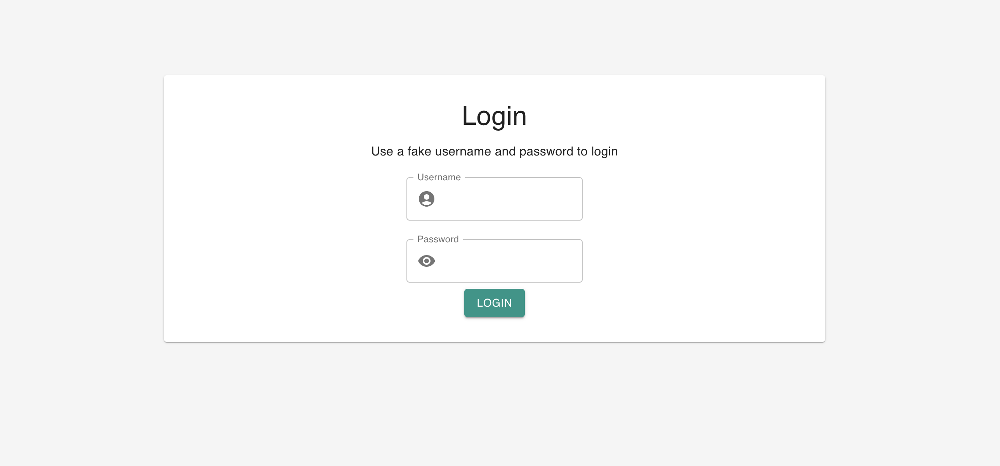
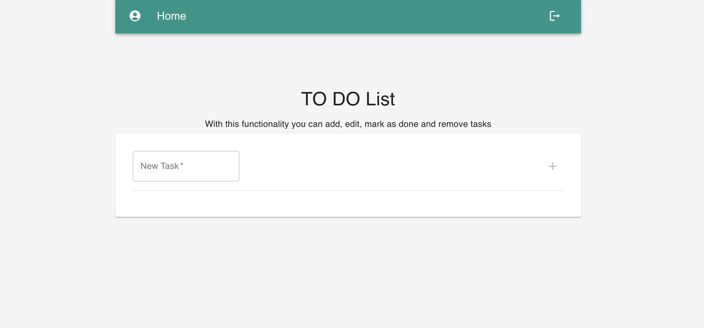
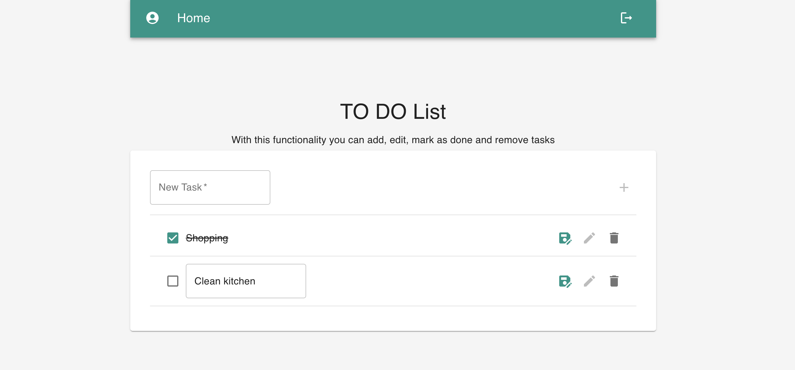
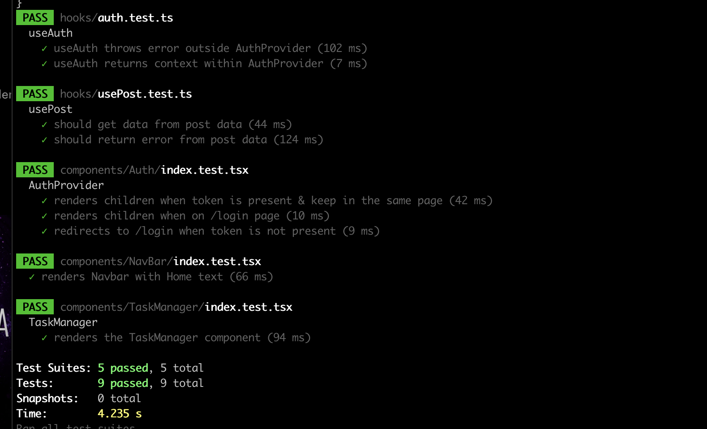

# Description

Project to log our day-to-day activities created with Next.js and TypeScript. Additionally, as a design system, I've utilized Material UI. This web app consists of two pages, the login page, which will always be accessed as long as there is no token saved in the application. To obtain this "fake" token, I've created a small API in Next.js that returns this token and saves it in localStorage. I've established a context to retrieve that token, and if it's not found, it redirects us to the login page. Once we've logged in with a fake username and password, we'll proceed to the main page where we have the main functionality to add, edit, mark as done, and delete tasks.

Additionally, I've created tests for the core functionalities of the application.

I have set up a small pipeline to deploy this project on GitHub Pages (https://alvaroalmonacidrojo.github.io/to-do-task/). However, it is advisable to test it locally since the API is not operational on GitHub Pages.
# Set up

Install dependencies

```bash
yarn
```

Run the project locally

```bash
yarn dev
```

## Screenshots

Login



Home



Add Task



Tests




## Run tests
```bash
yarn test
```